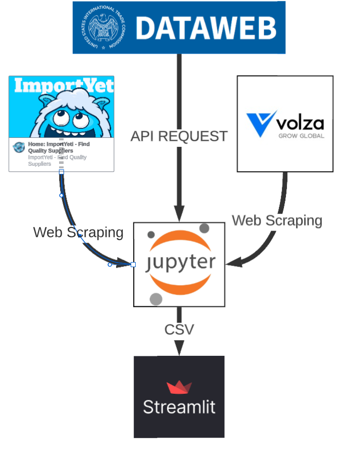
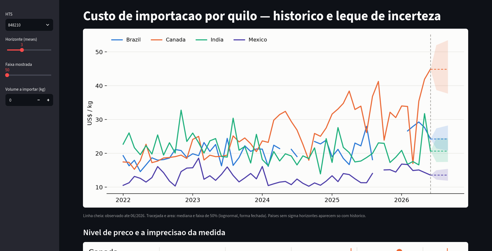
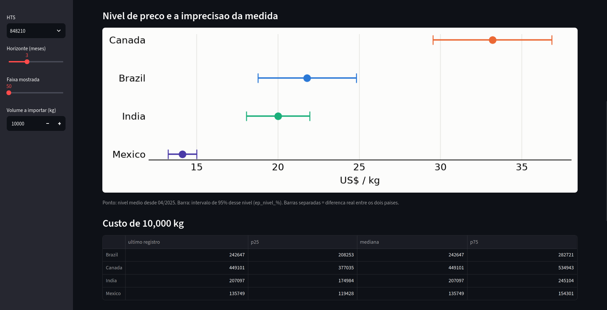
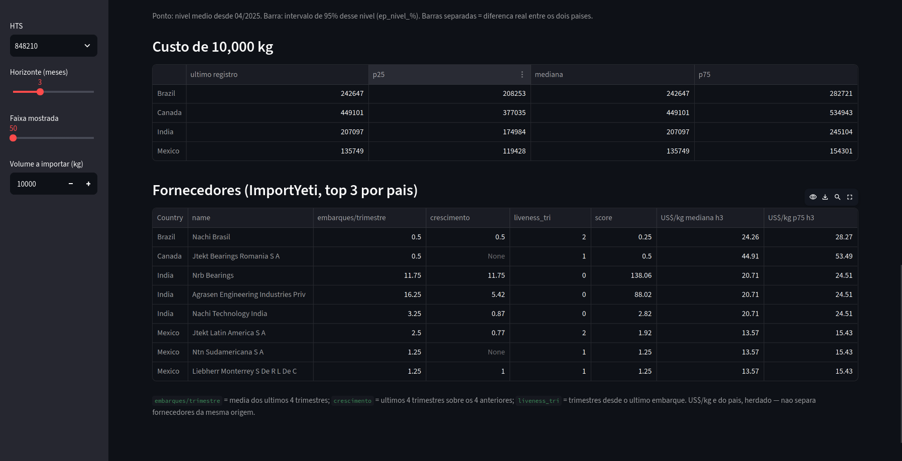

# Suppliers: custo de importação por quilo e ranking de fornecedores

Este projeto tenta responder duas perguntas sobre a importação de dois produtos (HTS 7306.30, tubos soldados de seção circular em aço não ligado, e HTS 8482.10, rolamentos de esferas) vindos de Brasil, Canadá, Índia e México: quanto custa o quilo importado de cada país e quais fornecedores valem a pena. Para isso ele junta três fontes gratuitas: a API do USITC DataWeb (valor, peso, frete e imposto por distrito aduaneiro e mês), o ImportYeti (embarques por fornecedor, raspado com Selenium) e o Volza (embarques individuais com nome de shipper e consignee, também raspado). O caderno `presentation.ipynb` faz a coleta, a limpeza e a análise; o `results.py` é um app Streamlit que mostra a série de US$/kg com o leque de incerteza por horizonte.

## Pipeline de dados

<!-- print do diagrama do pipeline -->


## Como rodar

```bash
git clone https://github.com/newtonepv/Suppliers.git
cd Suppliers

python3 -m venv .venv
source .venv/bin/activate

pip install --upgrade pip
pip install pandas numpy matplotlib scikit-learn skforecast streamlit \
            selenium undetected-chromedriver jupyter
```

O DataWeb exige um token de API (gratuito, criado na conta do USITC). Deixe-o em uma variável de ambiente ou em um arquivo no home:

```bash
export DATAWEB_TOKEN="seu-token"
# ou
echo "seu-token" > ~/.dataweb_token
```

A raspagem usa um clone do perfil do Chrome, para herdar a sessão já logada e passar pelo antibot. Instale o **Google Chrome** (o pacote `.deb`, não o Chromium do snap, porque o caminho do perfil está fixo em `~/.config/google-chrome`), abra uma vez para o perfil ser criado e feche completamente antes de rodar o caderno.

O `config.json` tem uma única chave:

```json
{
  "has volza account": true
}
```

Com `true` o caderno roda inteiro. Com `false` ele pula o filtro de fornecedores (seção 4c) e os dois cruzamentos que dependem do `volza_shipments.csv` (seções 6 e 9). O resto, DataWeb, ImportYeti e o ranking, continua funcionando, porque o ImportYeti é público e não precisa de conta.

Depois:

```bash
jupyter notebook presentation.ipynb   # coleta e análise
streamlit run results.py              # visualizador
```

## Visualizador

<!-- print do app Streamlit -->




## Resultados

**Não foi possível prever os preços a partir da gasolina canadense.** O experimento usa a linha de gasolina do CPI canadense como variável exógena de um `ForecasterRecursive` com Ridge e 3 lags, treinado em 85% da série. O modelo até acompanha algo parecido com uma média móvel, mas o erro continua grande demais para servir de previsão, e não existe relação visível entre o preço da gasolina e o US$/kg dos quatro países.

**O ruído da série não é o culpado.** O US$/kg mensal por país já sai de um filtro de outliers feito em granularidade menor: cada par distrito-mês é comparado com a mediana móvel de 3 registros da série nacional e descartado se ficar 3x acima ou 3x abaixo dela, e só depois disso os distritos são somados em país. Como a razão é sempre soma(valor)/soma(peso), nunca média de razões, a série que chega no modelo já está limpa: a oscilação que sobra é sinal, não ruído de medição.

**Também não foi possível chegar a um preço por fornecedor**, porque não deu para cruzar as fontes. O DataWeb vem da declaração aduaneira oficial, que cobre todos os modais mas é agregada por distrito e mês e não traz nome de empresa; o Volza e o ImportYeti vêm do manifesto marítimo da CBP, que traz o nome do shipper mas só cobre o que chega por navio. Como cada lado enxerga um recorte diferente das mesmas importações, um embarque nomeado não bate com uma célula de valor. E mesmo entre Volza e ImportYeti, que leem o mesmo manifesto, cada provedor faz a própria extração e limpeza, então as amostras também não coincidem. O ranking de fornecedores, portanto, fica baseado em frequência e crescimento de embarques, não em preço.
